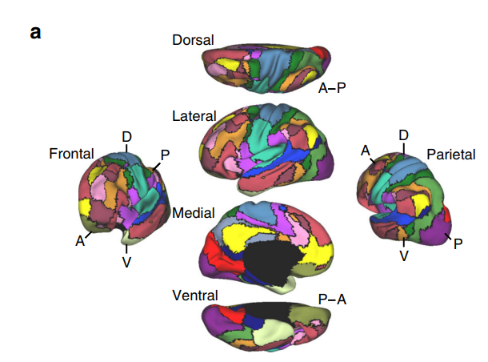

# Discussion

## 02/04
- Show that re-PLS is good in leakage split and no leakage split
- Longitudinal prediction performance of re-PLS

## 04/04
-  Show that re-PLS can ALSO predict multiple outcomes over time: (i) whether the trend is the same; (ii) how close the observed and predicted outcomes are overtime
- PLS vs re-PLS

## 05/04
[Reproducible brain-wide association studies require thousands of individuals](https://www.nature.com/articles/s41586-022-04492-9), [code]( https://gitlab.com/DosenbachGreene/bwas)

## 06/04
- Updated manuscript: (1) Geometry representation of PLS and re-PLS, (2) When to use PLS and when to use re-PLS, (3) Associative and Causal explanation of the re-PLS, (4) plots of X against Z  and Y against Z, (5) figure of P's and PQ's, (6) Add a figure including all the predicted plots
- Run the longitudinal analysis

Read more: 

[1] [Modular preprocessing pipelines can reintroduce artifacts into fMRI data](pdf/Lindquist%20et%20al%20(2018).pdf) -> showing graphs to compare different methods and then providing biological findings

[2] [Mendelian randomization](pdf/Sanderson%20et%20al%20(2022).pdf) -> to highlight (1)

## 08/04
-  Add every detail of information about the data
-  Add every detail about how you (or others) preprocessed the data
-  Redraw figures 2 and 3, and complete table 1
-  Insert the sections regarding the geometric interpretation and when to use PLS vs re-PLS
- Explain what you mean by associative (causal) interpretation
- Add a description of y1-y8, what are they and what do they measure. 

## 16/04
**Simulation**
-  Scenario 1: Y and Z are correlated. Run bootstrap experiments to show re-PLS is better than PLS, PCR, and regression.

- Scenario 2:  Z is not correlated with Y.  Show that re-PLS is similar to PLS and both re-PLS and PLS will do better than PCR and regression.

- Check whether the estimated PQ is close to the true PQ (either quantifying the distance between the true PQ and estimated PQ, correlation, or visually judging their location on the brain space).

- Ps are non-orthogonal/orthogonal

## 16/04
- Show that (a) they are similar if confounders are balanced; (b) re-PLS is the best if the confounders are not balanced. 

## 17/04
- Colour code your violin plots

[Heritability of individualized cortical network topography](https://www.pnas.org/doi/pdf/10.1073/pnas.2016271118)

- Reduce cortical/anatomical regions into 10 - 20 regions

[The organization of the human cerebral cortex estimated by intrinsicfunctional connectivity](https://journals.physiology.org/doi/epdf/10.1152/jn.00338.2011)

[Somatosensory-Motor Dysconnectivity Spans Multiple Transdiagnostic Dimensions of Psychopathology](https://www.researchgate.net/publication/334015204_Somatosensory-Motor_Dysconnectivity_Spans_Multiple_Transdiagnostic_Dimensions_of_Psychopathology)

[The human cortex possesses a reconfigurable dynamic network architecture that is disrupted in psychosis](https://www.nature.com/articles/s41467-018-03462-y.pdf)

