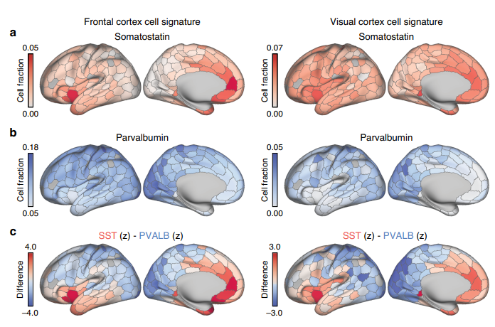

# Contents

## 1. Experiments
## 2. Discussion

## Conclusion
-----------------------
----------------------

## Discussion

[Transcriptional and imaging-genetic association of
cortical interneurons, brain function, and
schizophrenia risk](https://www.nature.com/articles/s41467-020-16710-x.pdf)
## Conclusion