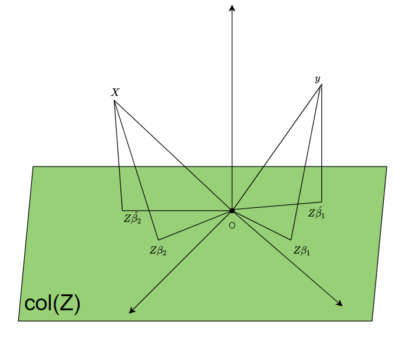
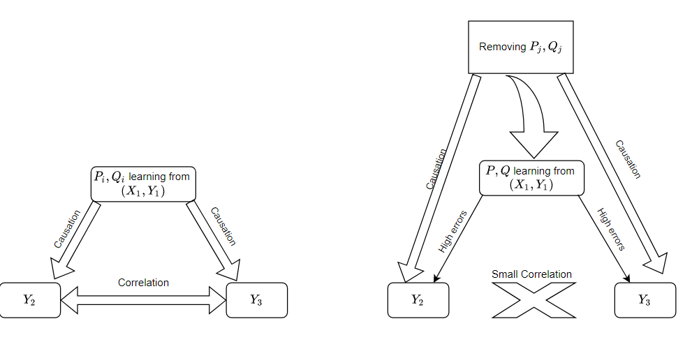
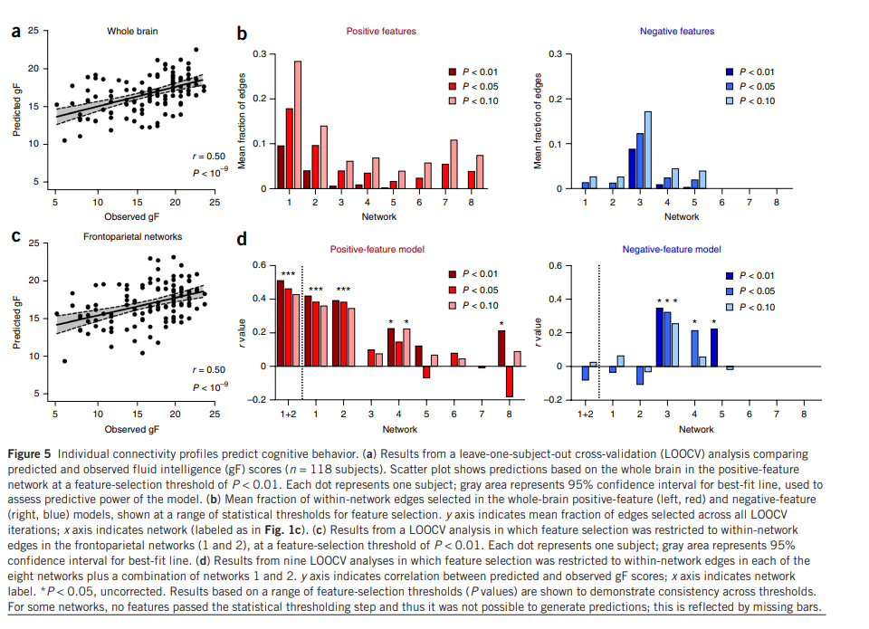

# Contents

## 1. Average results
## 2. Explanation/Compare PLS/re-PLS
## 3. Causation property experiment design
## Conclusion
-----------------------
----------------------
## 1. Average results
### 1.1 Split data
[split data](figure_html/split_fold.html)
### 1.2 Results of folds
[surface one spliting](figure_html/result_surface_one.html)

[volume one spliting](figure_html/result_surface_one.html)

### 1.3 Mean results
[surface mean](figure_html/result_surface_mean.html)

[volume mean](figure_html/result_surface_mean.html)
### 1.4 Compare surface vs volume results
[surface vs volume](figure_html/result_features_surface_volume.html)
### 1.5 Leakage vs no leakage
[leakage vs no leakage one splitting](figure_html/leakage_no_leakage_all.html)

[leakage vs no leakage mean](figure_html/leakage_no_leakage_mean.html)
## 2. Explanation/Compare PLS/re-PLS
Geometry representation of least square

- Result: Scatter plot + correlation coefficient

[Scatter plot + correlation coefficient outcome1](figure_html/scatter_outcome_cofounder_1.html)

[Scatter plot + correlation coefficient outcome2](figure_html/scatter_outcome_cofounder_2.html)

[Scatter plot + correlation coefficient outcome3](figure_html/scatter_outcome_cofounder_3.html)

[Scatter plot + correlation coefficient outcome4](figure_html/scatter_outcome_cofounder_4.html)

[Scatter plot + correlation coefficient outcome5](figure_html/scatter_outcome_cofounder_5.html)

[Scatter plot + correlation coefficient outcome6](figure_html/scatter_outcome_cofounder_6.html)

[Scatter plot + correlation coefficient outcome7](figure_html/scatter_outcome_cofounder_7.html)

[Scatter plot + correlation coefficient outcome8](figure_html/scatter_outcome_cofounder_8.html)

## 3. Causation property experiment design

## Discussion

[Functional connectome fingerprinting: identifying individuals using patterns of brain connectivity](https://www.nature.com/articles/nn.4135)

## Conclusion 

