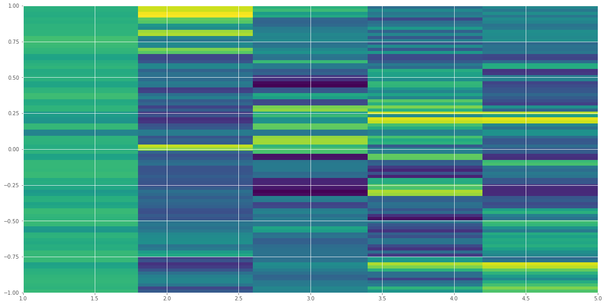
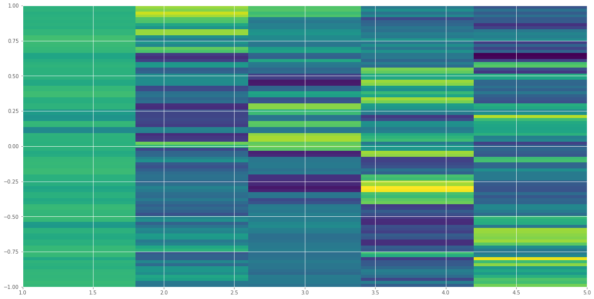
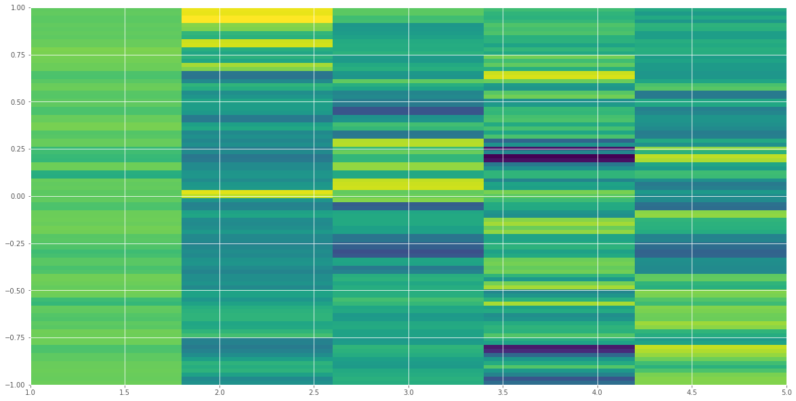
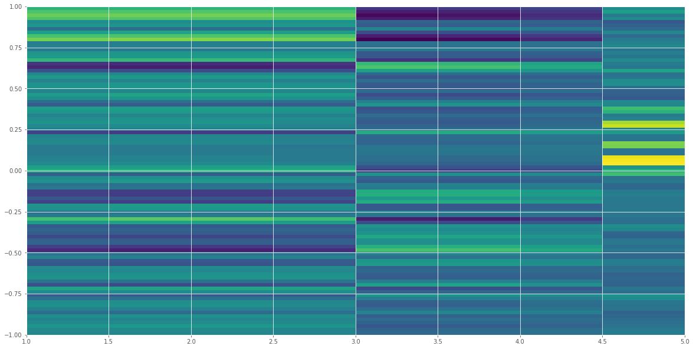
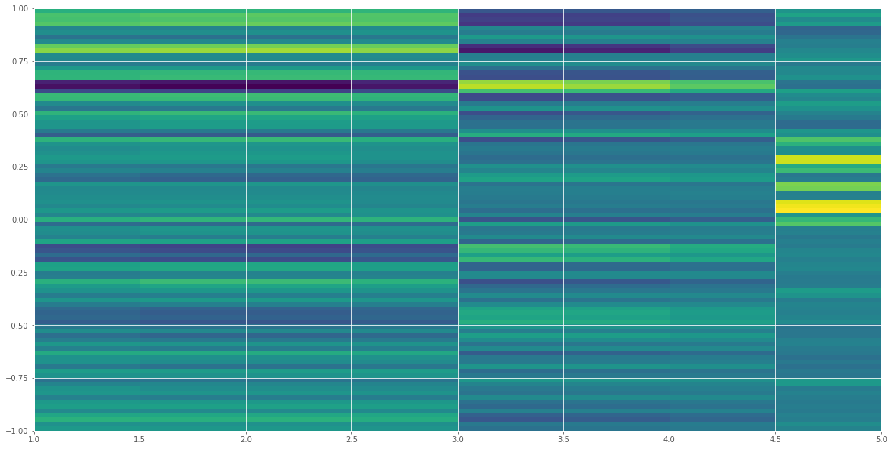
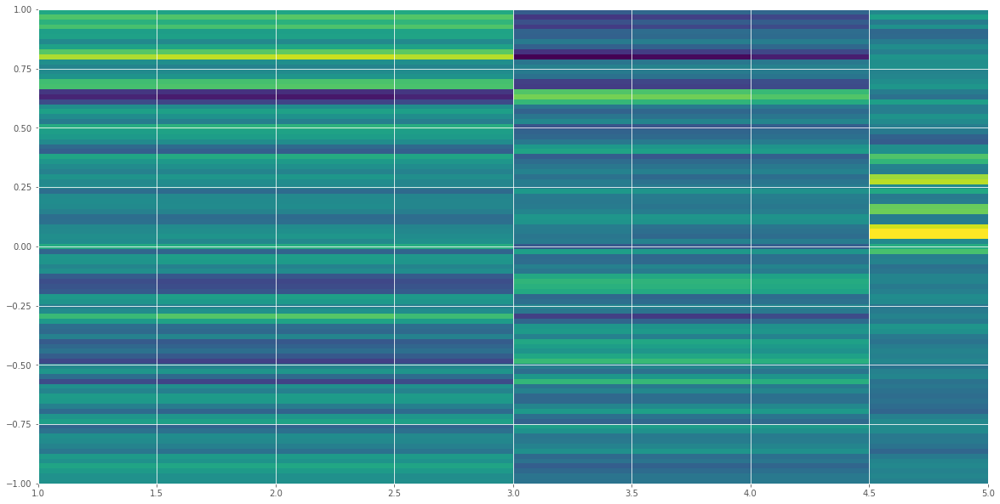
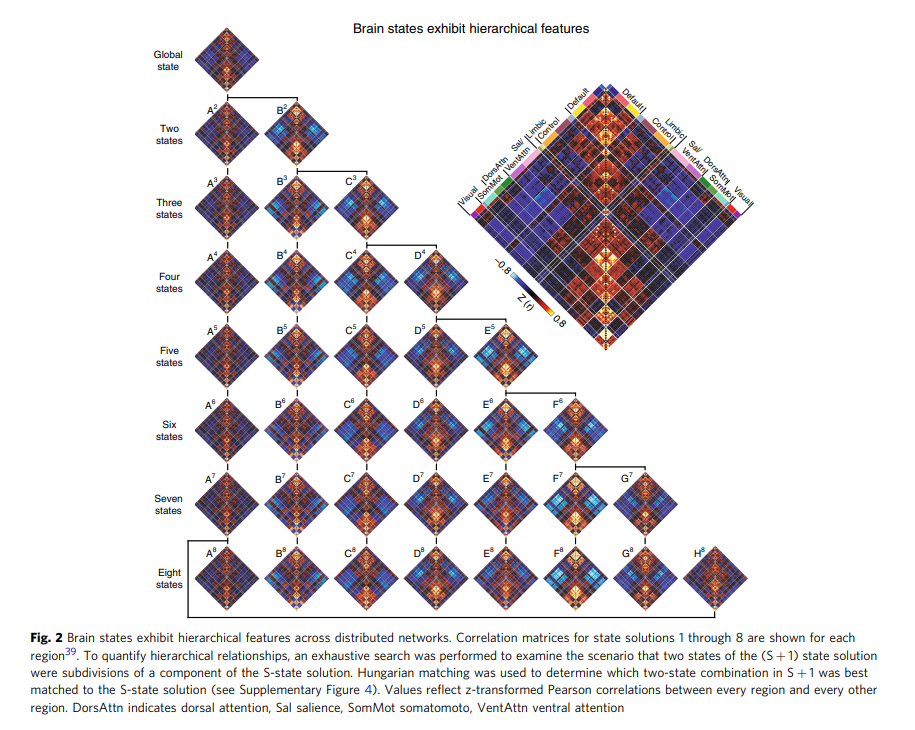
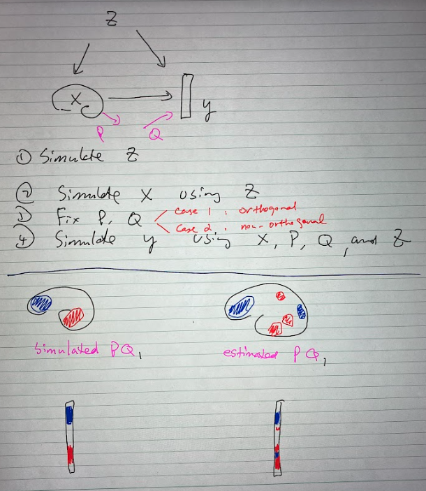

# Contents

## 1. Results
- How confounders affect the inputs, outputs
- Explain the results
## 2. Discussion 
- Email
- Others
## Conclusion
-----------------------
----------------------
## 1. Results

### Explain results
Questions:
- Are the results consistent between folds? What is main difference/common in results between folds?
- Compare results between components? 
- Explain why low/high value in P,PQ?

To answer these questions, I analyse in 2 views: Brain space view and Feature view

**Brain space view**

**Feature view**

$P \in \mathbb{152 \times 5 }$ (152 regions, 5 components) in fold 0

fold 1

fold 2

$PQ \in \mathbb{152 \times 8}$ (152 regions, 8 outputs) in fold 0

fold 1

fold 2

## Discussion
[Violin plot Matlab](https://github.com/bastibe/Violinplot-Matlab)

[Brain charts for the human lifespan](https://www.nature.com/articles/s41586-022-04554-y#MOESM1), [Interactive tool](https://brainchart.shinyapps.io/brainchart/), [Code](https://github.com/brainchart/Lifespan)

[The human cortex possesses a reconfigurable
dynamic network architecture that is disrupted in
psychosis](https://www.nature.com/articles/s41467-018-03462-y.pdf)

Need to describe the outcomes in detail

**Simulation**

References: [Identifying neural signatures mediating behavioral symptoms and psychosis onset: High-dimensional whole brain functional mediation analysis](https://www.sciencedirect.com/science/article/pii/S1053811920309939), [Supporting information](https://ars.els-cdn.com/content/image/1-s2.0-S1053811920309939-mmc1.docx)

Read/Pratice writing: [BT Thomas Yeo](https://scholar.google.com/citations?user=BOUzsU8AAAAJ&hl=en&oi=ao), [Tom Nichols](https://scholar.google.com/citations?user=OTJoPikAAAAJ&hl=en&oi=sra), [Steve Smith](https://scholar.google.com/citations?user=gRptb5UAAAAJ&hl=en&oi=sra)
## Conclusion

