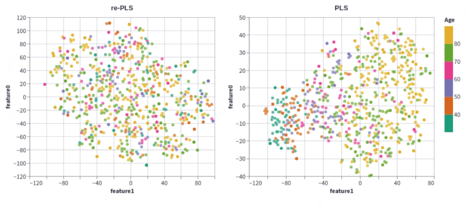
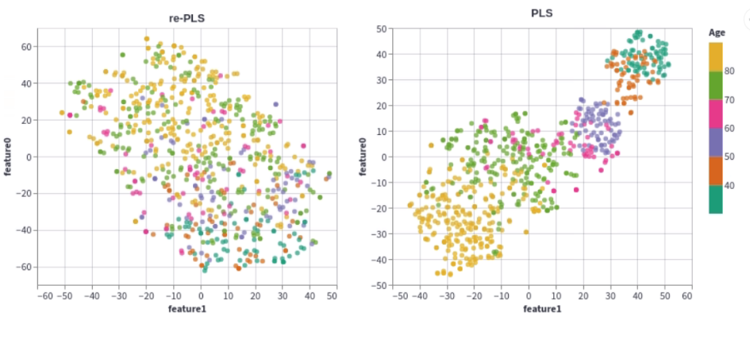
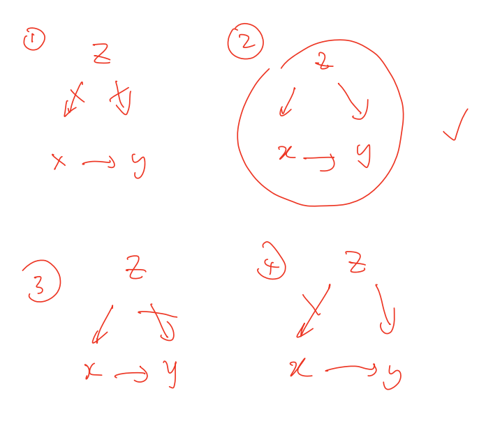

# Contents
## Simulation

### 1. Modeling
 - Top-down vs bottom up approach for generating X,Y,Z, PQ,... 
 - Confounders are balanced/unbalanced
 - (X,Z) and (Y,Z) are (not)correlated
 - Orthogonal/non-orthogonal basis

### 2. Evaluation
 - Pearson correlation, MSE
 - Feature space against age/gender
 - Angle/Correlation between PQ_true and PQ_PLS, PQ_rePLS
 - Bootstrapping Confidence Intervals of evaluating PQ

### 3. Conclusion after discussion

-----------------------
----------------------

### 1. Modeling
Denote $N$ is the number of samples(1 sample/person). To begin with, I start with confounder $Z$, $Z$ includes age and gender. In gender, I encode male to 1 and female to 0, and the number of male is controled by male_ratio (0-1) ($N_{male} = \textrm{int}(N*male_{ratio}), N_{female} = N - N_{male} $). In ages, I divided into 3 groups: group 1 (30-50 years old), group 2 (51-70 years old), group 3 (71-90 years old). The number of people in each group is controled by age_ratio1, age_ratio2, age_ratio3 (age_ratio1 + age_ratio2 + age_ratio3 = 1) ($N_{age1} = \textrm{int}(N*age_{ratio1}),N_{age2} = \textrm{int}(N*age_{ratio2}),N_{age3} = \textrm{int}(N*age_{ratio3}))$. In the balance scenerio,  male_ratio=0.5 and age_ratio1$\sim$0.33, age_ratio1$\sim$0.33, age_ratio1$\sim$0.33. 

I divide into 2 types of approaches to generate X,PQ. The first is bottom-up approach, start with PQ basic function that we already know or assume about specific properties ( Oliver et al., 2021 [1]). Then we can use those basic functions to generate X,Y. The second approach is called top-down approach where I start with random X (constrasted by low rank) then you calculate basic function of X, then I randomly choose some components as true basic function as PQ (I follow up this [this tutorial](https://scikit-learn.org/stable/auto_examples/cross_decomposition/plot_pcr_vs_pls.html)). In this tutorial they use PCA to simulate orthogonal basic function and in my simulation, I use singular value decomposition (SVD) for orthonormal basic and nonnegative matrix factorization (NMF) non-orthogonal basic to initialize input matrix with rank $R_X \le \min(N,I)=I$.

In case of NMF:
    $$W,H = \textrm{NMF}(\textrm{size}(X_{true}), \textrm{rank}=R_x) \\ 
    X_{true} = WH.$$
In case of SVD:
$$ U,S,V = \textrm{svd}(\textrm{size}(X_{true})) \\
X_{true} = U(:,:R_X)S(:R_x,:R_x)V(:,:R_x)^T$$
 Where $X_{true} \in \mathbb{R}^{N \times I}$, $I$ is the number of input features (can be surface regions or volume regions).
 $K$ is the number of latent components, so we can select randomly $K$ basic function from $W$ (NMF) or $U$(SVD).
 $$P_X = W[\{\textrm{select K components}\}]$$ 
 or
 $$P_X = U[\{\textrm{select K components}\}]$$
 Simulate $PQ$:
 $$PQ = P_{X}*\alpha*Q$$
Where $\alpha$ is setted as $\textrm{rand}(K,K)$, is regression coefficient matrix from input score matrix to output score matrix and Q is setted as $\textrm{rand}(K,J)$, is output loading maxtrix in PLS algorithm.
The observation of input can be modeled like that:
$$X_{observe} = X_{true} + Noise_X+ f_{ZX}(Z_{balance})$$
Where $Noise_X$ is represented as input noisy measurement. $Noise_X$ can be controled by parameter $SNR_X$ (be the same for every features). $SNR_X = \frac{1}{I}\sum_i^I SNR_{X(:,i)}, SNR_{X(:,i)}= 20\log\frac{\sum_j X_{true}(j,i)}{\sum_j Noise_{X}(j,i)}$. I use uniform distribution and normal distribution to simulate $Noise_X$. For each features/columns $Noise_{X(:,i)}= \textrm{randn}(N,1))  \sqrt(\frac{\sum_j X_{true}^2(j,i)}{SNR_X})$ and $Noise_{X(:,i)}= \frac{\textrm{rand}(N,1))}{\sqrt(1/12)}  \sqrt(\frac{\sum_j X_{true}^2(j,i)}{SNR_X})$ because $\textrm{VAR}[\textrm{uniform distribution}] = 1/12$. The function $f_X$ model how $Z$ affects $X$. Asssume that $Z$ affects $X$ equally and of course, $Z$ can be weighted in some specific ages or genders, it depends on the types of diseases or the outcomes we measure. In this simulation, I choose $f_X$ as linear transformation $f_X = Z_{balance} \beta_{ZX}$, $\beta_{ZX} \in \mathbb{R}^{R \times I}$ is randomly initialized. The parameter $SNR_{ZX}$ controls how much effects Z have on X. Similarly, I define $SNR_{ZX} = \frac{1}{I}\sum_i^I SNR_{f_{ZX}(:,i)}, SNR_{f_{ZX}(:,i)}= 20\log\frac{\sum_j X_{true}(j,i)}{\sum_j f_{ZX}(j,i)}$. For each features/columns $f_{ZX}(:,i)= \textrm{randn}(N,1))  \sqrt(\frac{\sum_j X_{true}^2(j,i)}{SNR_{ZX}})$ and $f_{ZX}(:,i)= \frac{\textrm{rand}(N,1))}{\sqrt(1/12)}  \sqrt(\frac{\sum_j X_{true}^2(j,i)}{SNR_{ZX}})$.
The observation of output can be model like that:
$$y_{observe} = y_{true} + Noise_y+ f_{Zy}(Z_{balance})$$
where $y_{true} = X_{true} PQ_{true}$, $Noise_{y(:,i)}= \textrm{randn}(N,1))  \sqrt(\frac{\sum_j y_{true}^2(j,i)}{SNR_y})$ and $Noise_{y(:,i)}= \frac{\textrm{rand}(N,1))}{\sqrt(1/12)}  \sqrt(\frac{\sum_j y_{true}^2(j,i)}{SNR_y})$. $Noise_y$ represents something that are not come from PQ (for example other diseases) or latent factor. $f_y = Z_{balance} \beta_{Zy},\beta_{Zy} \in \mathbb{R}^{R \times J}$ is also randomly initialized.

### 2. Evaluation
Consider 4 scenerios as following:
 - Z does not affect both X,Y (1)
 - Z affect only X and does not affect Y (2)
 - Z affect only Y and does not affect X (3)
 - Z affect both X,Y (4)
 We use 2 types of metrices here: accuracy (through MSE, Correlation coefficent) Explanality (through  t-SNE visualization of the feature space.

In scenerio (1) the performance of re-PLS and PLS are almost similar. 

When Z affects X (2) and (4), we can see clearly how Z affects not only in distribution of input measurements but also in feature space. With small effect setting SNR_ZX =10, we can see little different between distribution of X against gender and age groups.

However in feature space, let look at the figure bellow

We can see clearly how confounders (age for example) affects. In Partial Least Square (PLS) regression, we regress directly X to y and dont use any infomation of Z. By project X in input loading matrix $P$ in PLS, we can see some patterns of features against age. However, by using re-PLS, we remove this confounder effects. Therefore, rePLS features give a better explanation than PLS's in term of neurobiology. When we increase the level that Z affects X (for example SNR_ZX = 0), we can see it more clearly in both input features and projected features

. However, if Z affects X too much both rePLS and PLS give same low performace.

When Z affects y (3), re-PLS can outperform  PLS in accuracy (MSE, correlation corefficent). And in the last scenerio, the result is not very clearly, I suppose we need to consider how much similarity Z and Z_true (in this case Z_true is Z_balance).

### 2. Evaluation
To evaluate wherether re-PLS, PLS can be able to uncover the truth ($PQ_{true}$), I use (i) correlation coefficient, (2) cosin distance and  (3)plotting signals.

#### Correlation coefficient

The figure above shows the the Correlation coefficient between PQ_i_true and PQ_i_estimated. However, I think that this metric consider PQ_i_true and PQ_i_estimated as 2 sample and not care about the order/the direction of vector PQ.

####  Cosin distance (in degree)

To compare the direction between PQ_i_true and PQ_i_estimated, I calculate the cosin distance between PQ_true and PQ_estimated (0 deg means same direction and 90 deg means they are orthogonal). The results show that it is hard to uncover exactly the direction although the noise is very low (see figure below all SNR is 100), we still cannot get the true direction (0 deg)

#### Plotting signals
The last way I use to compare PQ is to plot signals. I run 32 bootstraps (due to limitation of the vizualization toolboxes that can only process under 5000 rows). In each bootstrap, I sample 70% number of all sample (with replacement) for training and the rest for testing. After that, I plot confident interval of all bootstrap results(blue band) and compare to the truth signal (red line).

### Discussion
<!--  -->

### Conclusion 
<!-- Try split real data, parameter control -->

[1] Chén, Oliver Y., Hengyi Cao, Huy Phan, Guy Nagels, Jenna M. Reinen, Jiangtao Gou, Tianchen Qian et al. "Identifying neural signatures mediating behavioral symptoms and psychosis onset: High-dimensional whole brain functional mediation analysis." NeuroImage 226 (2021): 117508.

[2] Zhao, Qingyu, Ehsan Adeli, and Kilian M. Pohl. "Training confounder-free deep learning models for medical applications." Nature communications 11, no. 1 (2020): 1-9.

