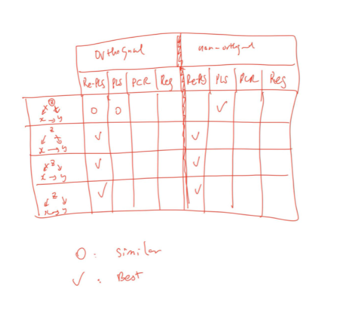

# Contents
## 1. counfounder + residual regression vs directly regression

## 2. PLS vs PCR vs MLR

## 3. Robustness improvement
----------------------------
----------------------------
<!-- Writing check result, something feel not right=> check some mistakes -->
<!-- some mistakes last weel -->
# 1. Counfounder + residual regression vs directly regression
## Model

(red: can be affected by Z, blue: not affected by Z)
- Directly regression
    y = XY_regression (can be affected by Z)
- Counfounder + residual regression
    y = ZY_regression (can be affected by Z) + residual_regression (not/less affected by Z)
Therefore, for example, we can guess that when Z does not affect X,Y and (Z only affects Y), the result of rePLS and PLS are quite the same, when Z does not affect Y and Z affects X  and the scenario Z affects both X,Y the result of re-PLS is much better than PLS's. 

## Simulation

### Features are not afected by confouder (Explanation) 

### Better results (Accuracy: MSE, correlation coefficent)

In training/bootstrapping (resample), the results of re-PLS and PLS are almost the same. 

When I evaluate results in a new set or a blind testing set, the results of re-PLS and PLS can be significant different due to the difference of Z_test and Z_train. We consider 4 scenarios:

In the first, third scenario, Z does not affect X and Y. The results of rePLS and PLS look quite similar.

In the second, forth scenario, The results of rePLS are much better than PLS;s.

## 2. PLS vs PCR vs MLR

MLR:  unique minimum for the sum of squares of the residual error the y-direction

PLS, PCR: the error squares are minimized perpendicular to the principle components (inputs/output)

PCR: first K principle compenents of input matrix
PLS: K principle compenents maximize correlation scores between input matrix and output matrix.  

Toy-example shows when PLS is better than LS
LR training

PLS training

$U,S,V = svd(X)\\
$
X_rotation = X + U*diag(rand)*V'*SNR

LR testing + input small rotation 

PLS testing + input small rotation 

## 3. Robustness improvement

[Robust neural networks with random weights based on generalized M-estimation and PLS for imperfect industrial data modeling](pdf/j.conengprac.2020.104633.pdf) [1].

** Simulation Model**

<!-- # Manuscript hoàn thiện hơn -->
<!-- Bootstrap is not suitable for simulation, keep same ground truth (PQ) change X,Z for simulation -->
<!-- Training same but if test diff => # -->
<!-- Different distruibution train/test -->

<!-- training -> same // testing distribution change => change -->

# References:

[1] Zhou, Ping, Jin Xie, Wenpeng Li, Hong Wang, and Tianyou Chai. "Robust neural networks with random weights based on generalized M-estimation and PLS for imperfect industrial data modeling." Control Engineering Practice 105 (2020): 104633.